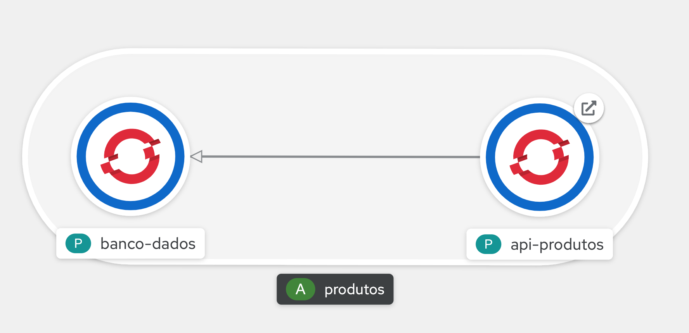

# Fiap - Fase 4 - Projeto de Entrega

## Projeto



### Banco de Dados

Banco de dados é uma instância do MySQL.
Criado através de um Pod como exemplo.

### API Produtos

API para gerenciar produtos (exemplo das aulas).
Criado através de um Deployment contendo o Pod.

URLs:

- Local: `http://localhost:8080`
- OpenShift (exemplo): `http://api-produtos-entrega.apps.na46.prod.nextcle.com`

Listagem de produtos:

```sh
curl $URL/products
```

Cadastro de um produto:

```sh
curl -X POST $URL/products -H 'Content-type:application/json' -d '{"name": "PS5", "description":"Console PlayStation 5"}'
```

## Rodar Projeto Local com Docker

```sh
docker-compose up
```

## Build do Projeto

```sh
# login no Quay.io
podman login -u $QUAY_USER quay.io

# build da imagem
podman build -t fiap/fiap-api-produtos:1 .

# envia imagem para o registry
podman push fiap/fiap-api-produtos:1 quay.io/$QUAY_USER/fiap-api-produtos:1
```

## Deploy no OpenShift

Logar no cluster pelo CLI (acessos do DO180):

```sh
oc login -u $RHT_OCP4_DEV_USER -p $RHT_OCP4_DEV_PASSWORD $RHT_OCP4_MASTER_API

oc new-project entrega
```

Rodar os comandos:

```sh
# criar o secrets
oc create -f BancoDados-Secret.yml

# criar o banco de dados MySQL
oc create -f BancoDados-Pod.yml
oc create -f BancoDados-Service.yml

# criar a aplicação
oc create -f ApiProdutos-Deployment.yml
oc create -f ApiProdutos-Service.yml
oc create -f ApiProdutos-Route.yml
```

## Stress Test

Para rodar o stress test instale o [K6](https://k6.io/).
Talvez seja preciso rodar `ulimit -n 250000` para permitir maior número de conexões na máquina local.

```sh
sh stress-test-run.sh
```

O stress test roda aumentando a carga de 100 VU durante 30 seg e mantém no nível por mais 1 min antes de aumentar novamente.
A quantidade de VU é aumentada até 400 antes de finalizar o teste.
